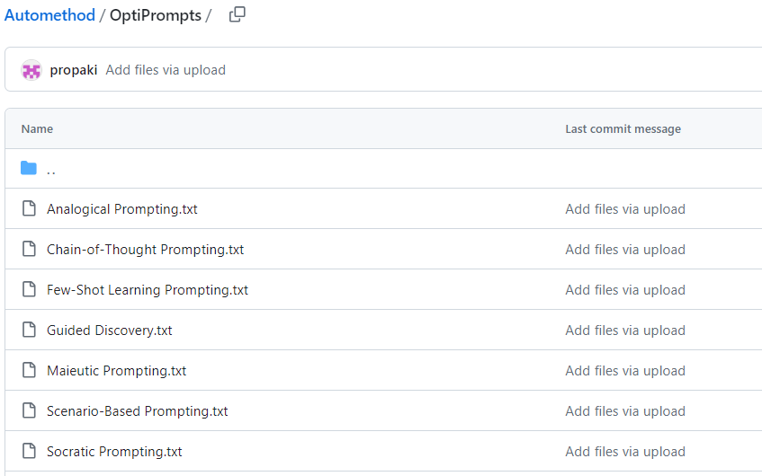
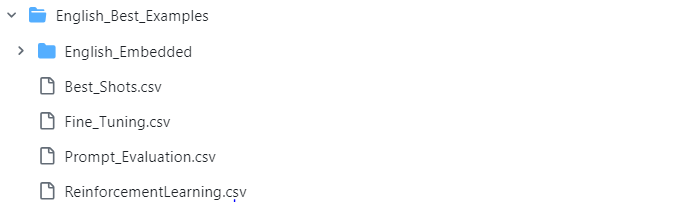

# Replication package for paper : "Automated Suggestion of Method Names According to Functional Descriptions"

# Overview:
mNamer introduces a novel approach to automatically suggest high-quality Java method names using Large Language Models (LLMs). Leveraging the advanced understanding capabilities of LLMs for natural language descriptions of method functionalities, mNamer combines specialized pre-processing and customized post-processing techniques, including semantics-driven analysis and reinforcement learning from human feedback. This method aims to align generated names with established naming conventions, enhancing code readability and maintainability.
Datasets
This repository includes two key datasets:
# Datasets:
There are two datasets are used to evalatute the approach
- English Dataset: Method Names with English Functional Descriptions (Dataset of Baseline).
- Chinese Dataset: Method Names with Chinese Functional Descriptions. The Dataset organized from [Java 11 API Reference](https://www.apiref.com/java11-zh/java.base/module-summary.html)
Each dataset is crucial for training and evaluating the models to ensure they perform effectively across linguistic boundaries.
# Corpus of Prompts: 
Included in the "OptiPrompts" folder is a carefully curated corpus of prompts, comprised of text files, designed to enhance the performance of ChatGPT in accurately generating Java method names based on functional descriptions. These prompts are crafted to elicit precise and contextually relevant responses from the model, adhering to a well-designed template that aligns with the naming conventions and requirements specific to Java methods.

# Supervised Fine Tuning (SFT) training corpus:
The Chinese-SFT-Training-Corpus.JSONL and English-SFT-Training-Corpus.JSONL files in the "SFT-Training-Corpus" folder are specifically tailored for fine-tuning the Large Language Model (LLM) to enhance its capability in generating method names from functional descriptions in Chinese and English. It contains a collection of high-quality conversation samples between two individuals. Each sample comprises a pair: a functional description and the corresponding method name, meticulously extracted through the Best-Example process. This corpus aims to improve the model's accuracy and fluency in handling Chinese language inputs, ensuring the generation of contextually appropriate and conventionally accurate method names.
# RNN-Attn-Copy (Baseline Model)
We meticulously reproduced and implemented the baseline model in "Source-Code", which is a RNN-Attn-Copy equipped with both attention and copying mechanisms. This advanced architecture was chosen as our benchmark for assessing the performance of alternative models due to its proven prowess in sequence-to-sequence translation tasks and its exceptional ability to grasp contextual nuances within sequences.
# mNamer Approach: Semantic-Driven Preprocessing and Fine-Tuning:
The mNamer methodology is structured around two core components:
Semantic-Driven Preprocessing and Fine-Tuning, designed to optimize the process of generating accurate Java method names from functional descriptions.
## 1) Semantic-Driven Preprocessing:
This phase begins with the selection of the best examples of functional descriptions and method names from our dataset. Utilizing the Python script **SelectBestExamples.ipynb** found in the Source-Code folder, we identify the top 1,800 examples. These are then divided into four subsets as follows:

- 300 samples for **Fine_Tuning.csv**
- 500 for **Best_Shots.csv**
- 500 for **Prompt_Evaluation.csv**
- 500 for **ReinforcementLearning.csv**
The 500 Best-Shots are converted into vectors using the BERT model through **EmbeddingBestExamples.ipynb**, to calculate semantic similarity. These vectors are stored in the **English_Embedded** folder.
Using **Prompt_Evaluation.csv**, we assess the prompt corpus in the **OptiPrompt** folder. To select 30 relevant shots for a given functional description, **SelectBestShots.ipynb** compares semantic similarity with the vectors in the **English-Embedded** folder, extracting the top 30 relevant examples. This process ensures the creation of an optimal prompt containing best shots that are semantically relevant to the input functional description.
## 2) Fine-Tuning
The fine-tuning stage is divided into two key parts: Supervised Fine Tuning (SFT) and Reinforcement Learning from Human Feedback (RLHF).

### 2A) Supervised Fine Tuning (SFT): 
Using **English-SFT-Training-Corpus.JSONL**, which contains 300 **Fine_Tuning.csv** samples in a conversational style, we fine-tune the LLMs (e.g., GPT-3.5-turbo) with **Fine-Tuning(SFT+RLHF).ipynb**.
### 2 B) RLHF:
We evaluate the semantic similarity between generated method names and the actual method names provided in **ReinforcementLearning.csv**, corresponding to the given functional descriptions. Feedback is then given to the SFT-tuned LLM through prompts to further refine its output.
Through this meticulous approach, mNamer aims to enhance the LLM's ability to generate method names that are not only accurate but also semantically aligned with the developers' intentions, thereby improving code readability and maintainability.
# mNamer
fine-tuned ready to chat ChatGPT4 extention availabe at https://chat.openai.com/g/g-T58v7ELEM-mnamer
The source code is the centerpiece of this repository, showcasing the application of BERT-based semantic model for both Semantic Driven Preprocessing and BERT-based RLHF in Postprocessing for LLMs to improve its method naming capabilities. This model represents a significant advancement in the field of automated method naming.

Getting Started
To get started with mNamer:
Install the required dependencies: pip install -r requirements.txt
Follow the instructions in the usage_instructions.md file for detailed steps on how to train and evaluate the models using the provided datasets and prompts.
Contribution
Contributions to LLM-MethodNamer are welcome. If you have suggestions for improvement or want to report bugs, please open an issue or submit a pull request.
